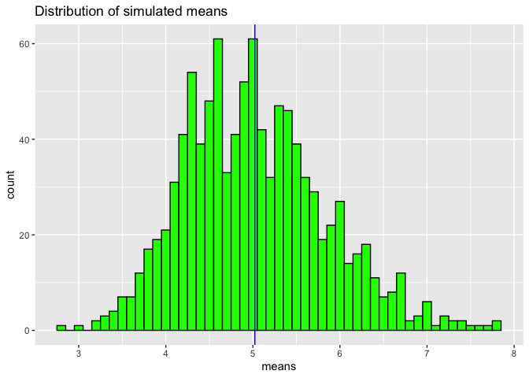
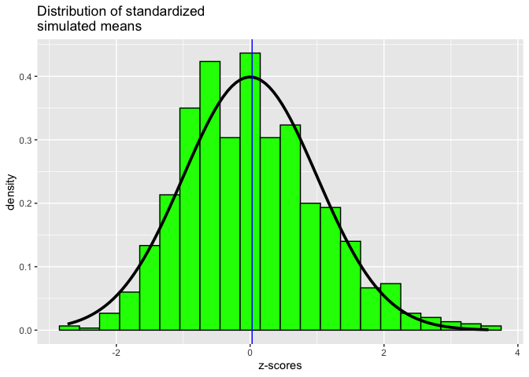

---

In this project I will investigate the exponential distribution in R and compare it with the Central Limit Theorem. I will investigate the distribution of averages of 40 exponentials. Note that you will need to do a thousand simulations.

Let's first load the libraries needed for the simulations. 


```r
# Libraries
library(dplyr)
library(ggplot2)

# Parameters
lambda <- 0.2
n <- 40
num_of_sim <- 1000

# Set the seed
set.seed(123456)

# Build a 1000x40 matrix with the simulation results
sim_matrix <- matrix(data=rexp(n * num_of_sim, lambda), nrow=num_of_sim)
```

### Sample mean vs theoretical mean

Take the means and store the results in _sim_means_ and compare the theoretical mean for an the monte carlo simulation, given by mu = 1/lambda = 5, as mean of our simulated distribution.


```r
# Mean for each of the 1000 simulations (rows)
sim_means <- data.frame(means=apply(sim_matrix, 1, mean)) 

# For printing
sim_means <- tbl_df(sim_means)

# Mean of the simulated means
(mean_sim <- sim_means %>% summarize(simulated.mean = mean(means)) %>% unlist())
```

```
## simulated.mean 
##       5.022915
```

```r
# Pictures!
ggplot(data = sim_means, aes(x = means) ) + geom_histogram(binwidth= .1, fill = "green", color = "black") +
  geom_vline(xintercept = mean_sim, color="blue", size = 0.5) +
  ggtitle("Distribution of simulated means")
```

<!-- -->

The distribution of the means (green bars) is centered around the mean of our simulated distribution (blue line), that is **4.982365** which is very close to the calculated mean 1/lambda = **5**

### Sample Variance versus Theoretical Variance


```r
# Variance of the sample means
sd_samp <- sd(unlist(sim_means$means))
(var_samp <- sd_samp ^ 2)
```

```
## [1] 0.6557463
```

```r
# Calculated variance of the monte carlo simulation
(((1 / lambda)) / sqrt(40))^2
```

```
## [1] 0.625
```

The numbers are close, 0.628253 and 0.625, respectively.

### Normality of the Distribution

The Central Limit Theorem states the distribution of averages of normalized variables becomes a standard normal distribution as we increase the sample size. 

I will transform each mean in our simulated data according to the following formula:

$$ Z = {(\bar{X} - {1 \over \lambda}) \over ({1 \over \lambda} / \sqrt(n))} $$

This should result in a normal distribution centered at zero. I create a plot comparing the density of our transformed sample means distribution with the density of the standard normal distribution.


```r
# Mean of our normalized means
(z_mean <- sim_means %>%  mutate(z_score = (means - 1/lambda) / (1/lambda / sqrt(n)))  %>% select(z_score) %>%
   summarise(z_mean = mean(z_score)) %>% unlist())
```

```
##     z_mean 
## 0.02898559
```

```r
# Z scores 
sim_means %>%  mutate(z_score = (means - 1/lambda) / (1/lambda / sqrt(n))) %>% 
  ggplot(aes(x = z_score)) + 
   geom_histogram(binwidth = 0.3, fill="green", color="black", aes(y = ..density..)) +
   stat_function(fun = dnorm, size = 1.3) +
   geom_vline(xintercept = z_mean, color="blue", size = 0.5) +
   ggtitle("Distribution of standardized \nsimulated means") +
   xlab("z-scores")
```

<!-- -->

The normalized distribution of sample means (green bars) is approximately the same as the standard normal distribution (blue line) as we can see comparing it to the density function (black curve). The mean is -0.02230626, very close to zero. This is consistent with what is stated in the Central Limit Theorem. 
