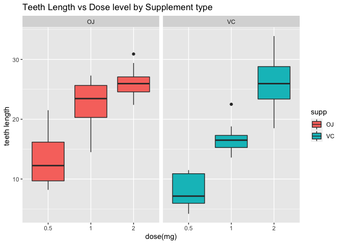
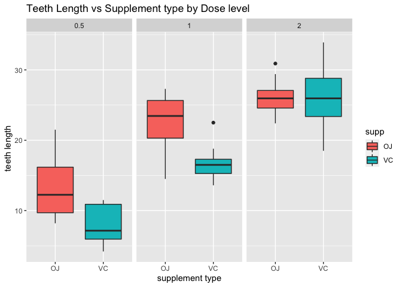

---

#### Instructions

* Load the ToothGrowth data and perform some basic exploratory data analyses

* Provide a basic summary of the data.

* Use confidence intervals and/or hypothesis tests to compare tooth growth by supp and dose. (Only use the techniques from class, even if there's other approaches worth considering)

* State your conclusions and the assumptions needed for your conclusions.

---

### Exploratory data analysis

Let's first load the libraries needed for the analysis 


```r
# Load required packages
library(dplyr)
library(ggplot2)

#Load data and convert to tbl format
ToothGrowth <- tbl_df(ToothGrowth)
```

Let's start with the structure of the data and summarize its variables.


```r
# Structure of the data
str(ToothGrowth)
```

```
## tibble [60 × 3] (S3: tbl_df/tbl/data.frame)
##  $ len : num [1:60] 4.2 11.5 7.3 5.8 6.4 10 11.2 11.2 5.2 7 ...
##  $ supp: Factor w/ 2 levels "OJ","VC": 2 2 2 2 2 2 2 2 2 2 ...
##  $ dose: num [1:60] 0.5 0.5 0.5 0.5 0.5 0.5 0.5 0.5 0.5 0.5 ...
```

```r
# Summary
summary(ToothGrowth)
```

```
##       len        supp         dose      
##  Min.   : 4.20   OJ:30   Min.   :0.500  
##  1st Qu.:13.07   VC:30   1st Qu.:0.500  
##  Median :19.25           Median :1.000  
##  Mean   :18.81           Mean   :1.167  
##  3rd Qu.:25.27           3rd Qu.:2.000  
##  Max.   :33.90           Max.   :2.000
```

ToothGrowth contains 60 observations of 3 variables:

* **len**: tooth length, numeric
* **supp**: supplement type (VC:Vitamin C or OJ:orange juice), factor
* **dose**: dose(in milligrams), numeric


```r
# Unique values in the dose vector
unique(ToothGrowth$dose)
```

```
## [1] 0.5 1.0 2.0
```

The numeric variable _dose_ contains only 3 unique values: 0.5, 1, 2. Let's convert it to a factor variable with three levels:


```r
# Convert to factor
ToothGrowth <- ToothGrowth %>% mutate(dose = as.factor(dose))
```

#### Pictures!

Let's look at the teeth length by supplement type.


```r
ggplot(data = ToothGrowth, aes(x=dose, y=len, fill = supp)) +
geom_boxplot() +
facet_grid(. ~ supp) +
ggtitle("Teeth Length vs Dose level by Supplement type") +
labs(x="dose(mg)", y= "teeth length ")
```

<!-- -->

This shows relationship between teeth length and dose level per each supplement type. It appears to be a positive correlation for both Vitamin C and Orange Juice.

Now let's look at teeth length by dose level.


```r
ggplot(data = ToothGrowth, aes(x = supp, y = len)) +
geom_boxplot(aes(fill = supp)) +
facet_wrap(~ dose) +
ggtitle("Teeth Length vs Supplement type by Dose level ") +
labs(x="supplement type", y= "teeth length ")
```

<!-- -->

Where as there appears to be a difference in teeth length the supplement types at lower dosages (0.5 and 1), there doesn't appear to be much difference at the highest dose (2.0).


```r
ToothGrowth  %>% 
  filter(dose == 2)  %>% 
  group_by(supp)   %>%  
  summarise(avg.length = mean(len))
```

```
## # A tibble: 2 × 2
##   supp  avg.length
##   <fct>      <dbl>
## 1 OJ          26.1
## 2 VC          26.1
```

Vitamin C appears to have a slight edge over Orange Juice at 2.0 mg, with average teeth length of 26.14 vs 26.06 respectively.

### Hypothesis Tests 

Now let's statistically compare teeth growth by supplement type and dose levels, using the t test. We'll run four tests: one to see if the supplements are significantly different, and then three at each dosage to test their differences.

**Testing by Supplement**


```r
# Testing by Supplement
t.test(len ~ supp, data = ToothGrowth)
```

```
## 
## 	Welch Two Sample t-test
## 
## data:  len by supp
## t = 1.9153, df = 55.309, p-value = 0.06063
## alternative hypothesis: true difference in means between group OJ and group VC is not equal to 0
## 95 percent confidence interval:
##  -0.1710156  7.5710156
## sample estimates:
## mean in group OJ mean in group VC 
##         20.66333         16.96333
```

Since the p-value of the test is 0.06 (and greater than 0.05) and the confidence
interval of the test contains zero, we fail to reject the null hypothesis. Restating, that is to say that different supplement types don't correlate to longer teeth length.

**Testing by dose levels**

Next is testing to see if the three dosages have a significant difference in teeth length.

First, create subsets based on the differences of dosages:

```r
# Create three subsets (by difference in dosages) for the t tests
ToothGrowth.doses_0.5_1.0 <- subset(ToothGrowth, dose %in% c(0.5, 1.0))
ToothGrowth.doses_0.5_2.0 <- subset(ToothGrowth, dose %in% c(0.5, 2.0))
ToothGrowth.doses_1.0_2.0 <- subset(ToothGrowth, dose %in% c(1.0, 2.0))
```


* Test 1, dose = 0.5 and dose = 1


```r
# Test 1, dose = 0.5 and dose = 1
t.test(len ~ dose, data = ToothGrowth.doses_0.5_1.0)
```

```
## 
## 	Welch Two Sample t-test
## 
## data:  len by dose
## t = -6.4766, df = 37.986, p-value = 1.268e-07
## alternative hypothesis: true difference in means between group 0.5 and group 1 is not equal to 0
## 95 percent confidence interval:
##  -11.983781  -6.276219
## sample estimates:
## mean in group 0.5   mean in group 1 
##            10.605            19.735
```

* Test 2, dose = 0.5 and dose = 2


```r
# Test 2, dose = 0.5 and dose = 2
t.test(len ~ dose, data = ToothGrowth.doses_0.5_2.0)
```

```
## 
## 	Welch Two Sample t-test
## 
## data:  len by dose
## t = -11.799, df = 36.883, p-value = 4.398e-14
## alternative hypothesis: true difference in means between group 0.5 and group 2 is not equal to 0
## 95 percent confidence interval:
##  -18.15617 -12.83383
## sample estimates:
## mean in group 0.5   mean in group 2 
##            10.605            26.100
```

* Test 3, dose = 1 and dose = 2


```r
# Test 3, dose = 1 and dose = 2
t.test(len ~ dose, data = ToothGrowth.doses_1.0_2.0)
```

```
## 
## 	Welch Two Sample t-test
## 
## data:  len by dose
## t = -4.9005, df = 37.101, p-value = 1.906e-05
## alternative hypothesis: true difference in means between group 1 and group 2 is not equal to 0
## 95 percent confidence interval:
##  -8.996481 -3.733519
## sample estimates:
## mean in group 1 mean in group 2 
##          19.735          26.100
```

For all three of the dosages t-tests, the p-value is less than 0.5 and the confidence intervals do not contain zero. We reject the null hypothesis. Restating, there is a significant difference that higher dosage levels correlates to an longer tooth length.


### Conclusions

By using t-tests, we should check for:

* Independent and identically distributed samples: there must be random sampling/assignment

* Normality: the population distribution must be normal or quasi-normal 

Assuming the above conditions are true, we now conclude:

**There is a statistically significant difference between teeth length and dose levels, restating, a positive correlation between higher dosages and longer teeth length.** 

**However, there is not a statistically significant difference between supplements.**
